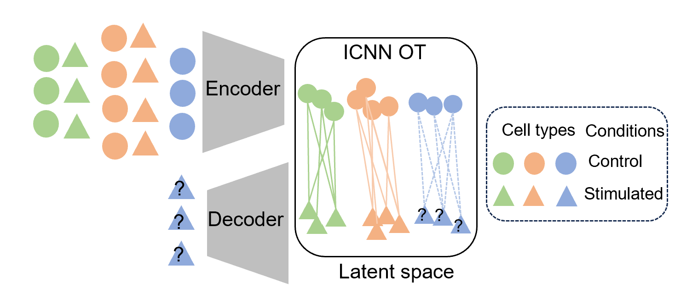

# SCREEN:predicting single-cell gene expression perturbation responses using optimal transport


## Overview of SCREEN

<div align=center>
    
    </div>  

## Installation

You can install SCREEN from GitHub via
```
git clone https://github.com/Califorya/SCREEN.git
```

## Dependencies
```bash
cd SCREEN
pip install -r requirement.txt
```
## Tutorial
#### Dataset
**adata**: AnnData object of shape `n_obs` × `n_vars`. Rows correspond to cells and columns to genes.

#### Usage
```bash
cd SCREEN/screen
python screen.py -in '../Example_data/pbmc.h5ad' -ou'../Result' --label 'CD4T' --condition_key 'condition' --cell_type_key 'cell_type' --ctrl_key 'control' --stim_key 'stimulated' --latent_dim 100 --batch_size 64 --epochs 40 --full_quadratic False --activation 'leaky_relu' --optimizer 'Adam'
```

#### args
* `-in`:The file path to read dataset
* `--label`: The file path to save results
* `--condition_key`: Key for condition in dataset
* `--cell_type_key`: The cell type to predict
* `--ctrl_key`: Key for control condition
* `--stim_key`: Key for stimulated condition
* `--latent_dim`: Dimension of the low-dimensional latent variable in the VAE model
* `--batch_size`: Size of the batches
* `--epochs`: Number of optimal transport epochs
* `--full_quadratic`: If the last layer is full quadratic or not
* `--activation`: Which activation to use for
* `--optimizer`: Which optimizer to use


